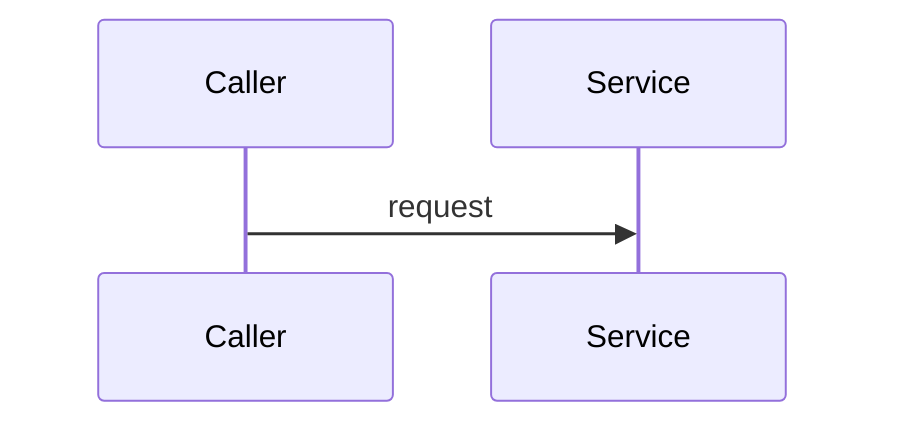

# <Flow>

## Trigger and outcome
## Preconditions
## Execution

1. `<path::symbol>` — action.
2. ...

## Sequence diagram

## Data transformations
## Side effects
## Errors and recovery
## Transaction boundary
## Idempotency and concurrency
## Observability
## Tests proving the flow
## Related modules and contracts
## Known gaps
