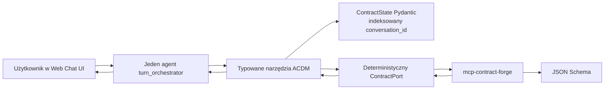

# Plan wykonania ACDM

## Cel

ACDM jest webowym asystentem, który interpretuje rozmowę, ale nie zna lokalnie
struktury kontraktu. Strukturę aktywnego wariantu, walidację i YAML dostarcza
`mcp-contract-forge`.

Najważniejsza zasada:

> LLM interpretuje. MCP opisuje i waliduje kontrakt. Pydantic utrwala stan.
> Deterministyczne narzędzia kontrolują każdą zmianę.



## Założenia prostego MVP

- Jeden agent Pydantic AI; bez subagentów i bez Pydantic Graph.
- Lokalny frontend z `Agent.to_web()`.
- Jedna typowana sesja `ContractState` na `conversation_id`.
- Historia rozmowy jest przekazywana przez Web Chat UI i dodatkowo kopiowana
  do stanu sesji.
- Stan biznesowy jest przechowywany w pamięci procesu. Restart zeruje sesje.
- Domyślny model jest konfigurowany przez `ACDM_MODEL`.
- Konfiguracja modelu, URL API i transportu MCP jest ładowana z `.env`.
- MCP jest wywoływany deterministycznie przez adapter, a nie wystawiany LLM
  jako swobodny katalog narzędzi.
- Odczyt wymagań source/targetów nie zatrzymuje rozmowy na deferred approval.
- Końcowy YAML wymaga potwierdzenia wbudowanego w Pydantic AI
  (`requires_approval=True`).

## Etap 1 — szkielet webowy

Status: wykonany w MVP.

Zakres:

- instalacja `pydantic-ai-slim[openai,web]`;
- agent nazwany `turn_orchestrator`;
- aplikacja Starlette tworzona przez `Agent.to_web()`;
- model i port konfigurowane zmiennymi środowiskowymi;
- `defer_model_check=True`, aby zbudowanie agenta nie wymagało klucza API;
- test web app używa wbudowanego `TestModel`, a uruchomienie właściwego modelu
  wymaga jego poświadczeń.

Kryterium ukończenia:

- `uvicorn acdm.main:app --host 127.0.0.1 --port 7932` uruchamia lokalny chat.

## Etap 2 — typowany stan sesji

Status: wykonany w MVP.

Zakres:

- `ContractState` przechowuje draft, evidence, aktywny katalog MCP,
  poprzednie walidacje, liczniki napraw i YAML;
- `SessionStore` indeksuje stan przez `conversation_id`;
- pełny aktywny katalog MCP jest walidowany jako `RequirementsCatalogue`;
- każda zmiana draftu zwiększa `revision`;
- poprzedni zatwierdzony YAML pozostaje jako `last_valid_rendered_yaml`.

Kryterium ukończenia:

- kolejne tury tej samej rozmowy widzą poprzedni draft i wymagania;
- zmiana wartości unieważnia bieżącą walidację i preview, ale nie usuwa
  ostatniej poprawnej wersji YAML.

## Etap 3 — wybór source i targetów

Status: wykonany w MVP.

Przebieg:

1. LLM rozpoznaje typ source z wypowiedzi użytkownika.
2. Jeżeli typ jest niepewny, agent pyta użytkownika.
3. Brak jawnego targetu oznacza tylko obowiązkową warstwę Bronze.
4. `configure_contract_scope` pobiera z MCP aktywny katalog.
5. MCP odrzuca pominięcie lub zmianę kolejności warstw.
6. Katalog jest zapisywany w sesji jako Pydantic, a model dostaje aktywny,
   ograniczony wycinek.
7. Wywołanie MCP ma timeout `ACDM_MCP_TIMEOUT_SECONDS`, domyślnie 15 sekund.

Kryterium ukończenia:

- CSV nie ładuje definicji fixed-width ani JDBC;
- wybór Gold aktywuje również Bronze i Silver;
- LLM nie tworzy ścieżek spoza `allowed_paths`.

## Etap 4 — semantyczne uzupełnianie draftu

Status: podstawowy wariant wykonany.

Przebieg:

1. Agent czyta całą historię przekazaną przez Web Chat UI.
2. Dopasowuje wartości użytkownika do `field_catalog`.
3. `apply_contract_patch` przyjmuje listę typowanych zmian.
4. Adapter rozwija dowolny patch obiektowy do liści i odrzuca go, jeśli choć
   jeden liść nie występuje w aktywnym katalogu.
5. Każda wartość otrzymuje provenance, confidence i `evidence_text`.
6. `get_contract_status` zwraca brakujące pola wymagane oraz nierozstrzygnięte
   sekcje opcjonalne z opisami i przykładami.
7. `set_optional_decisions` zapisuje zgodę lub rezygnację w stanie sesji,
   dzięki czemu odrzucona opcja nie wraca w kolejnych turach.

Kryterium ukończenia:

- odpowiedź „kolumny Bronze takie same jak CSV” może zostać zamieniona na
  jawne kolumny targetu;
- niejednoznaczna wartość kończy się pytaniem, nie zgadywaniem;
- poprawka użytkownika może zmienić dowolne wcześniej zapisane pole.

## Etap 5 — walidacja i kontrolowane naprawy

Status: wykonany w MVP.

Przebieg:

1. Walidacja jest możliwa dopiero po uzupełnieniu `required_paths`.
2. Draft trafia do `validate_contract` w MCP.
3. Błąd zawiera `path`, kod, komunikat i semantyczny `description` ze schema.
4. Agent może zastosować naprawę tylko na podstawie istniejącego evidence.
5. Liczba napraw bez udziału użytkownika jest ograniczona przez
   `ACDM_MAX_AUTOMATIC_REPAIR_ATTEMPTS` (domyślnie `2`).
6. Fingerprint blokuje ponowną walidację niezmienionego draftu.
7. Po wyczerpaniu limitu agent przedstawia problem użytkownikowi.

Kryterium ukończenia:

- identyczny draft nie jest wysyłany do walidacji drugi raz;
- każda automatyczna próba rzeczywiście zmienia dane;
- naprawa nie może zapisać ścieżki spoza katalogu MCP.

## Etap 6 — YAML i human-in-the-loop

Status: wykonany w MVP.

Przebieg:

1. `prepare_yaml_preview` działa wyłącznie po udanej walidacji bieżącej rewizji.
2. YAML jest generowany przez MCP, nigdy przez LLM.
3. Agent pokazuje pełny preview na czacie.
4. `approve_final_yaml` wymaga zatwierdzenia w Web Chat UI.
5. Odrzucenie wraca do rozmowy i pozwala opisać poprawki.
6. Zmiana po zatwierdzeniu uruchamia ponownie patch → validation → preview.

Kryterium ukończenia:

- bez walidacji nie powstaje YAML;
- zatwierdzony YAML ma fingerprint bieżącego kontraktu;
- użytkownik może odrzucić preview bez utraty draftu.

## Etap 7 — pliki wejściowe

Status: planowany po MVP.

Zakres:

- endpoint uploadu poza zarezerwowanymi trasami `to_web()`;
- limit rozmiaru, MIME, encoding, hash i bezpieczny artifact store;
- typowany `AttachmentPreparation`;
- chunkowanie dużych plików z trwałymi referencjami;
- cache według `file_hash + contract_fingerprint`;
- treść załącznika traktowana jako dane, nie instrukcje.

## Etap 8 — trwałość i produkcyjny frontend

Status: planowany.

Zakres:

- SQLite lub PostgreSQL zamiast pamięci procesu;
- zapis historii przez `ModelMessagesTypeAdapter`;
- optimistic locking po `revision`;
- uwierzytelnienie i autoryzacja sesji;
- własny frontend oparty na UI Event Stream zamiast developerskiego
  `Agent.to_web()`;
- limity wielkości promptu i kontrolowana kompakcja historii;
- opcjonalne Logfire bez pełnego przechwytywania poufnych payloadów.

## Uruchomienie MVP

```powershell
python -m venv .venv
.\.venv\Scripts\python.exe -m pip install -e ".[dev]"
# Uzupełnij OPENAI_API_KEY i ewentualnie OPENAI_BASE_URL w istniejącym .env.
.\.venv\Scripts\python.exe -m acdm.main
```

Do szybkich testów jednego procesu:

```powershell
# Ustaw ACDM_CONTRACT_TRANSPORT=inprocess w .env.
.\.venv\Scripts\python.exe -m acdm.main
```

## Źródła API

- [Web Chat UI i `Agent.to_web()`](https://pydantic.dev/docs/ai/guides/web/)
- [Historia i `conversation_id`](https://pydantic.dev/docs/ai/core-concepts/message-history/)
- [Human-in-the-loop i deferred tools](https://pydantic.dev/docs/ai/tools-toolsets/deferred-tools/)
- [Testowanie agentów](https://pydantic.dev/docs/ai/guides/testing/)
