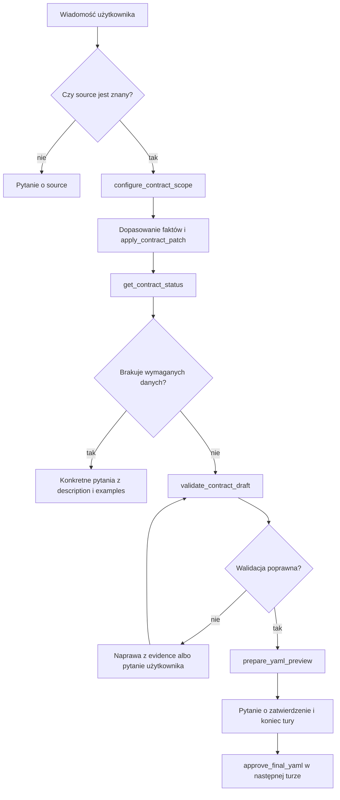

# Przepływ agenta

## Stan sesji

`ContractState` jest indeksowany przez Pydantic AI `conversation_id` i zawiera:

- aktywny source i targety;
- katalog `RequirementsCatalogue`;
- draft kontraktu;
- evidence z pochodzeniem i tekstowym uzasadnieniem;
- decyzje o sekcjach opcjonalnych;
- fingerprinty prób walidacji;
- ostatni wynik walidacji;
- oczekujący i ostatni zatwierdzony YAML;
- kopię historii rozmowy.

Zmiana draftu zwiększa `revision` i unieważnia bieżącą walidację oraz preview.
Nie usuwa poprzedniego zatwierdzonego YAML.

## Narzędzia

| Narzędzie | Znaczenie |
|---|---|
| `list_contract_options` | lista source i kolejność targetów |
| `configure_contract_scope` | pobranie i zapis aktywnego katalogu MCP |
| `set_optional_decisions` | włączenie albo pominięcie sekcji opcjonalnych |
| `apply_contract_patch` | zmiana wyłącznie ścieżek dozwolonych przez MCP |
| `get_contract_status` | braki, opisy, przykłady i aktualny draft |
| `validate_contract_draft` | walidacja kompletnego, zmienionego draftu |
| `prepare_yaml_preview` | YAML po poprawnej walidacji |
| `approve_final_yaml` | utrwalenie preview po zgodzie na czacie |

## Przebieg

## Niezmienniki

- jawnie podany source lub target nie wymaga dodatkowego potwierdzenia;
- brak targetu oznacza Bronze;
- warstwy mogą wystąpić tylko jako Bronze, Bronze+Silver albo wszystkie trzy;
- LLM nie może zapisać ścieżki spoza `allowed_paths`;
- patch obiektowy jest deterministycznie rozwijany do dozwolonych liści;
- każda wartość biznesowa musi mieć `evidence_text`;
- identyczny draft nie może być walidowany ponownie;
- naprawa automatyczna musi zmienić draft i respektować limit z konfiguracji;
- YAML pochodzi wyłącznie z MCP;
- zatwierdzenie YAML jest tekstową decyzją użytkownika w następnej turze.

## Historia i audyt

Pydantic AI dostarcza pełną historię do kolejnej tury. ACDM dodatkowo zapisuje
jej kopię w stanie sesji oraz rejestruje zdarzenia przez hooki. `ThinkingPart`
jest zapisywany tylko wtedy, gdy dostawca modelu jawnie go zwróci. Decision
trace opisuje obserwowalne argumenty, wyniki i evidence — nie udaje dostępu do
wewnętrznego chain-of-thought.
