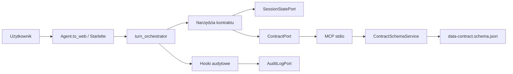

# Architektura

## Zakres

Repozytorium zawiera dwie aplikacje uruchamiane w jednym środowisku Python:

- ACDM — agent konwersacyjny i stan procesu;
- mcp-contract-forge — deterministyczna implementacja kontraktu.

## Granice odpowiedzialności

### ACDM

- interpretuje naturalny język;
- wybiera narzędzie i przygotowuje jego argumenty;
- zapisuje draft, evidence i wyniki w `ContractState`;
- nie zna lokalnie struktury wariantów kontraktu;
- nie generuje YAML.

### mcp-contract-forge

- odczytuje pełny JSON Schema;
- zwraca wyłącznie aktywny katalog wymagań;
- wykonuje strict validation;
- nadaje błędom ścieżki i opisy;
- generuje YAML wyłącznie z poprawnego draftu;
- nie korzysta z LLM.

## Moduły ACDM

| Moduł | Odpowiedzialność |
|---|---|
| `acdm.agent` | fabryka agenta i składanie zależności |
| `acdm.instructions` | instrukcje systemowe |
| `acdm.tools.contract` | narzędzia widoczne dla LLM |
| `acdm.models` | typowany stan i DTO narzędzi |
| `acdm.state_ops` | czyste operacje na drafcie |
| `acdm.session_port` | port magazynu stanu |
| `acdm.session_store` | adapter in-memory |
| `acdm.contract_port` | port Contract Forge i adaptery |
| `acdm.mcp_client` | współdzielony lifecycle transportu stdio |
| `acdm.audit` | port, adaptery, hooki i decision trace |

`create_agent()` przyjmuje opcjonalny `SessionStatePort`, dzięki czemu przyszły
adapter bazodanowy nie wymaga zmian w narzędziach agenta.

## Moduły Contract Forge

| Moduł | Odpowiedzialność |
|---|---|
| `schema_service` | stabilna fasada publiczna |
| `catalogue` | wybór wariantu, `$ref` i katalog wymagań |
| `validation` | JSON Schema, błędy i reguły semantyczne |
| `yaml_renderer` | serializacja poprawnego kontraktu |
| `schema_utils` | wspólne typy i fingerprint |
| `server` | cztery narzędzia MCP |

## Lifecycle MCP

`StdioMcpClient` uruchamia proces, inicjalizuje `ClientSession` i współdzieli ją
między kolejnymi wywołaniami. Wywołania są serializowane przez lock, a każde ma
timeout.

`acdm.web_app` opakowuje istniejący lifespan aplikacji `Agent.to_web()` i
rejestruje:

- `ContractPort.start()` jako zdarzenie startup;
- `ContractPort.close()` jako zdarzenie shutdown.

Adapter audytowy dekoruje operacje biznesowe, ale deleguje lifecycle do
wewnętrznego portu.

## Stan i trwałość

`InMemorySessionStore` zwraca głębokie kopie `ContractState`. Chroni własny
słownik przez lock, lecz dane są tracone po restarcie. Port umożliwia późniejsze
wprowadzenie bazy danych. Przed wdrożeniem adaptera współdzielonego należy dodać
optimistic locking albo atomowe aktualizacje stanu.

Historia przeglądarki i `ContractState` to dwa różne mechanizmy. Web Chat UI
przekazuje historię modelu, a ACDM kopiuje ją do `chat_history`. Log audytowy
jest trzecim, append-only zapisem diagnostycznym.

## Zasady rozszerzania

- nowe MCP otrzymuje osobny port i adapter;
- Contract Forge pozostaje autorytetem walidacji kontraktu;
- frontend nie komunikuje się bezpośrednio z MCP;
- specjalistyczne narzędzia nie powinny powiększać podstawowego promptu, jeśli
  nie są potrzebne w większości tur;
- zmiana storage nie powinna zmieniać narzędzi agenta.
